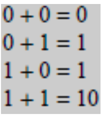

# Digital-2023-2

Los sumadores desempeñan un papel de gran relevancia no solo en el ámbito de las computadoras, sino también en una variedad de sistemas digitales que manipulan información numérica. Es esencial adquirir un conocimiento sólido sobre el funcionamiento de un sumador elemental al explorar los entresijos de los sistemas digitales.
Ahora bien, en este informe se presentará al sumador medio y al sumador completo. Recordemos lo básico acerca de la suma en binario:

Estas operaciones entonces son realizadas por un circuito lógico llamado sumador medio. Los medios sumadores son componentes fundamentales en sistemas digitales, ya que la aritmética binaria es esencial para realizar operaciones matemáticas y lógicas en un sistema electrónico. Además, los medios sumadores son la base para construir sumadores completos, que son capaces de sumar números de múltiples bits.

