# Digital-2023-2

Los sumadores desempeñan un papel de gran relevancia no solo en el ámbito de las computadoras, sino también en una variedad de sistemas digitales que manipulan información numérica. Es esencial adquirir un conocimiento sólido sobre el funcionamiento de un sumador elemental al explorar los entresijos de los sistemas digitales.
Ahora bien, en este informe se presentará al sumador medio y al sumador completo. Recordemos lo básico acerca de la suma en binario:

Estas operaciones entonces son realizadas por un circuito lógico llamado sumador medio. Los medios sumadores son componentes fundamentales en sistemas digitales, ya que la aritmética binaria es esencial para realizar operaciones matemáticas y lógicas en un sistema electrónico. Además, los medios sumadores son la base para construir sumadores completos, que son capaces de sumar números de múltiples bits.

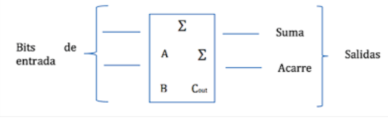

Haciendo una simplificación por Karnaugh, podemos sacar la ecuación de cada una de sus salidas:

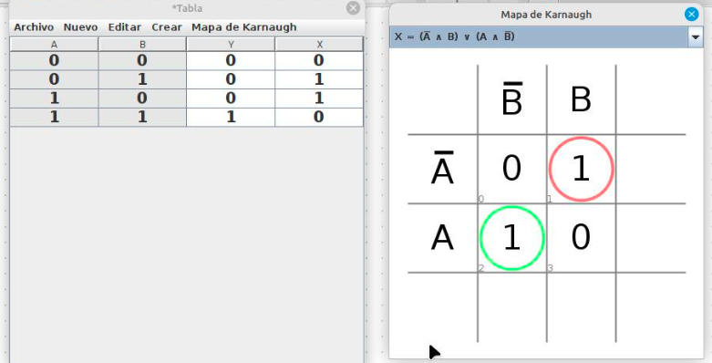

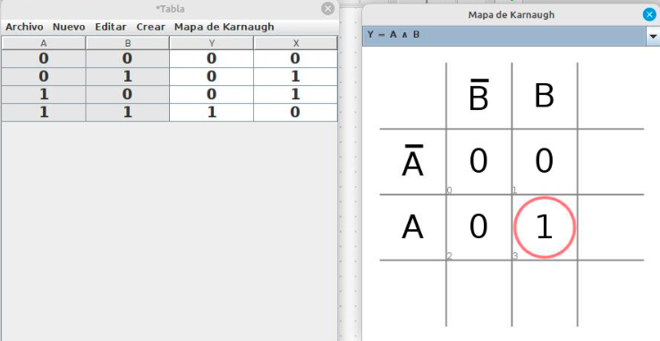

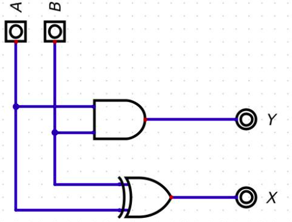

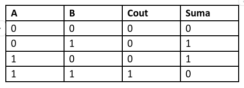

Podemos ver que la lógica de este es S = A ⊕ B Y Cout = AB 

Finalmente, viendo la simulación del sumador medio a partir de señales se muestra a continuación:

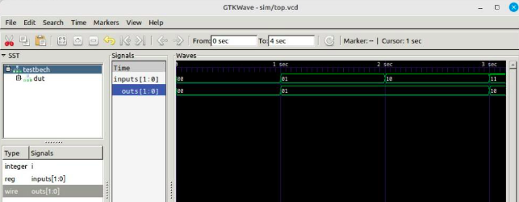

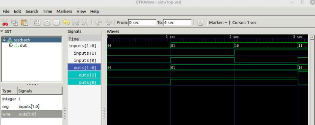

Ahora bien, el circuito que en el que se hacen con 3 bits o más, se le conoce como sumador completo. Los sumadores completos se utilizan en una amplia variedad de aplicaciones, desde operaciones aritméticas en microprocesadores hasta diseño de circuitos lógicos en sistemas digitales. También son componentes clave en la construcción de sumadores de números de varios bits y otros dispositivos lógicos más complejos.

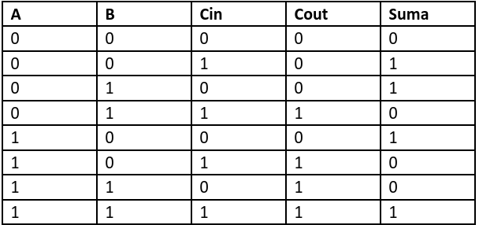

Y el circuito y su lógica se muestra en la siguiente figura

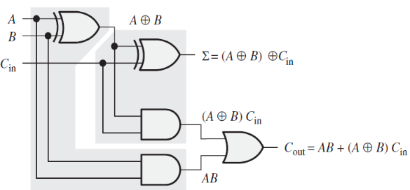

Ahora bien, para construir un sumador completo, podemos usar dos sumadores medio de esta manera: 

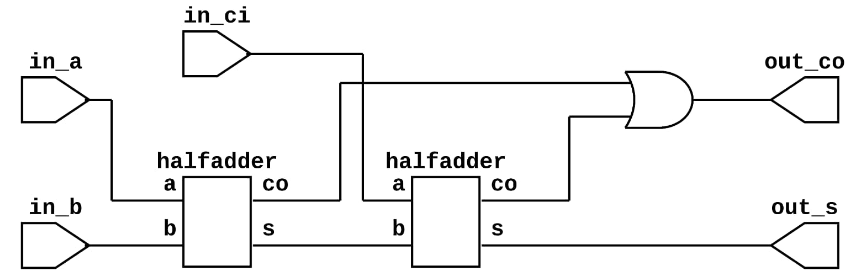

Finalmente, la simulación del sumador completo de tres bits a partir de pulsos es mostrada a continuación:

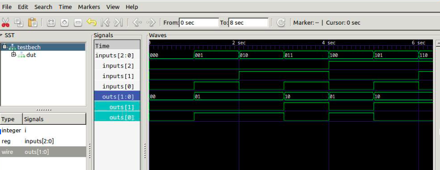

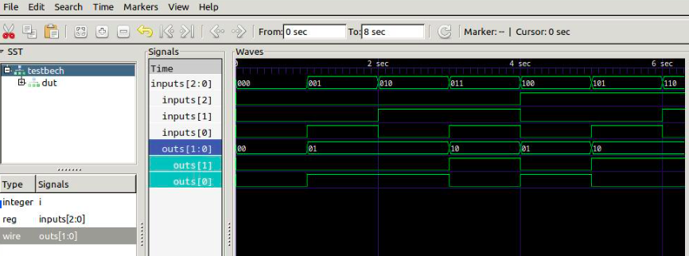

Teniendo en cuenta lo anterior, podemos construir un sumador completo de 4 bits, junto con su simulación

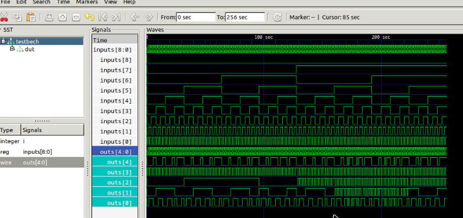

Para la realizaciòn y diseño del restador, se tiene en cuenta que el modulo que varia el comportamiento del mismo es simplemente el nombrado "halfadder" del sumador completo. El modulo correspondiente tiene el comportamiento mostrado a continuación:

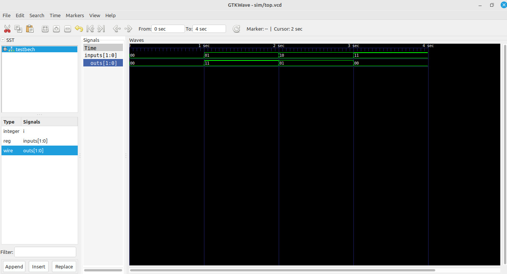

De lo anterior se puede observar que las salida (Y) es la misma que para el medio sumador, sin embargo, el "carry", que para el caso del restador es el "Borrow" es el que varia por las compuestas mostradas anteriormente.

Al reemplazar este nuevo mòdulo por los que antes consistian al "fulladder" se oberva lo mostrado a continuaión junto con su respectiva simulaciòn.

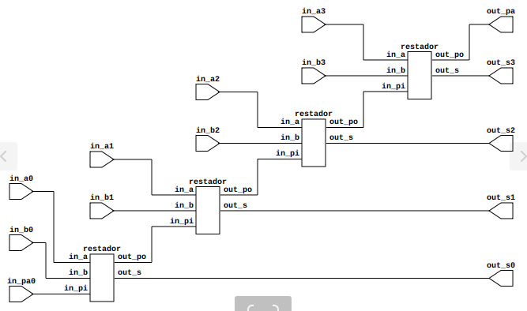

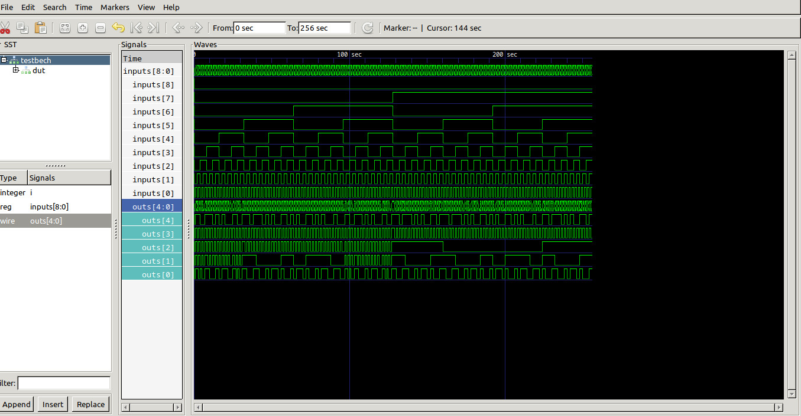

